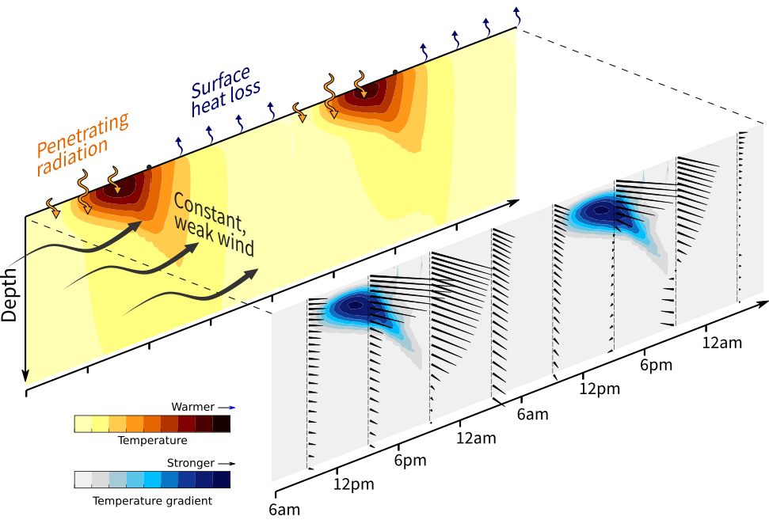
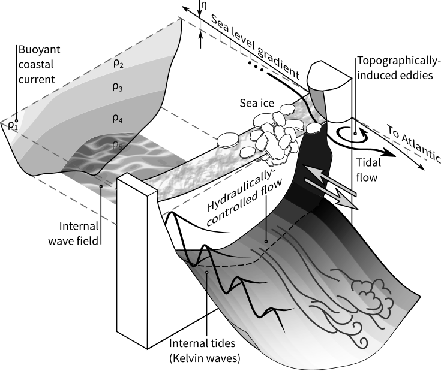
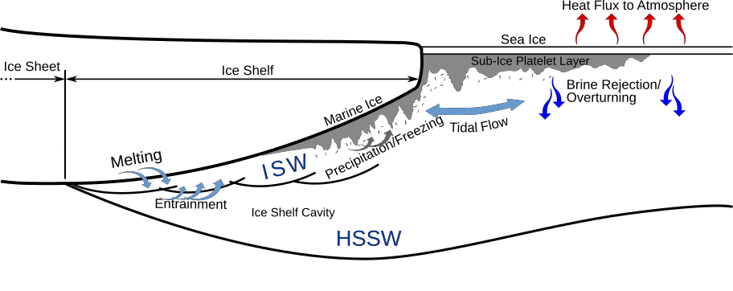

######  

## Current Research: Turbulence and shear in diurnal warm layers

Improved understanding of diurnal changes in the vertical distribution of heat and momentum of the upper ocean is necessary for better predictions of sea surface temperature, storms, and longer-term atmospheric variability such as monsoon cycles. It is challenging, however, to measure near-surface velocities and turbulence. Surface waves introduce errors into measurements from a fixed platform, prop wash and ship wake can ruin measurements above 5 m, and long time series are necessary to account for intermittent wave breaking events. My current research looks to quantify and understand near-surface dynamics such as shear and turbulence, with a particular focus on its diurnal evolution in the tropical ocean. 

{: style="text-align:center" }
 

#### Variation of near-surface shear induced by a diurnal temperature gradient

### Stratified tidal flows in the Canadian Arctic

Large-scale volume and freshwater fluxes through the Canadian Arctic Archipelago are driven by differences in density and atmospheric pressure. These fluxes, however, are modulated by smaller-scale (metre to kilometre) phenomena such as internal waves, topographically induced eddies, and hydraulic jumps. Such small-scale processes were the focus of my PhD research. They are not resolved by large-scale circulation models or mesoscale surveys. I therefore undertook process-oriented studies to understand and quantify the cumulative effect of these unresolved motions. Techniques include numerical modelling of the flows, analysis of shipboard data, and interpretation in terms of channel-flow theories.

{: style="text-align:center" }
  

#### Many of the phenomena that play key roles in the Archipelago

The Archipelago has complex but fascinating oceanography. To start, it is a meeting ground for waters from the Pacific, Arctic, and Atlantic Oceans. These waters flow through the many channels demarcated by a hundred major islands. While doing so, they encounter rough topography, strong tidal currents, and variable sea ice.

### Ice–ocean interactions in McMurdo Sound

Sea ice in regions near an ice shelf may be thicker than otherwise expected due to supercooled water. Waters tens of millikelvin cooler than the freezing point are commonly observed flowing northward from beneath the Ross/McMurdo Ice Shelves. Within the supercooled plume are small frazil ice crystals. My MSc research considered the fate of these crystals: their growth rate while suspended, the distance they travelled before precipitating, the drag they induce after they consolidate, and their effect on interactions at the base of sea ice.

{: style="text-align:center" }
  

#### Supercooled water is produced as comparatively fresh water rises up beneath an ice shelf

In related projects, I have 
* interpreted the occurrence of platelet ice around Antarctica from numerous published and unpublished studies
* analysed anomalies in thermistor arrays as proxies for brine convection
* developed models of the growth of ice within a borehole melted through an ice shelf
